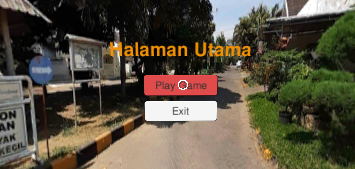
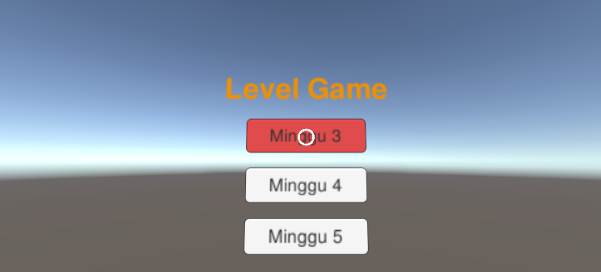
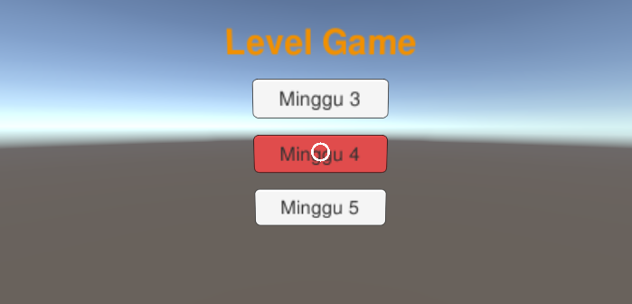
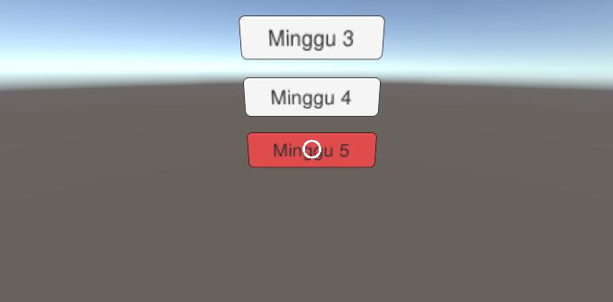
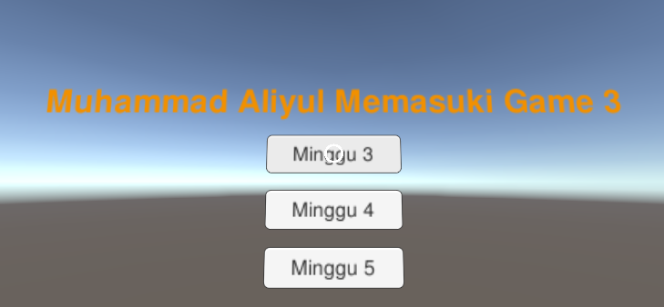
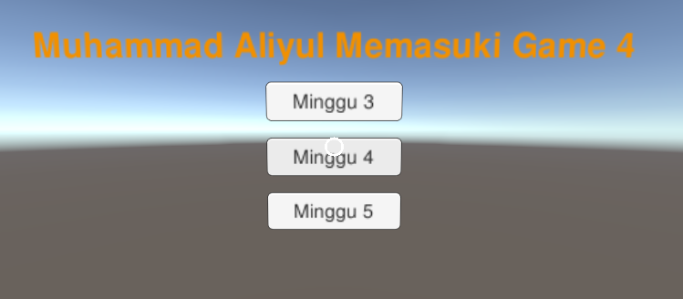
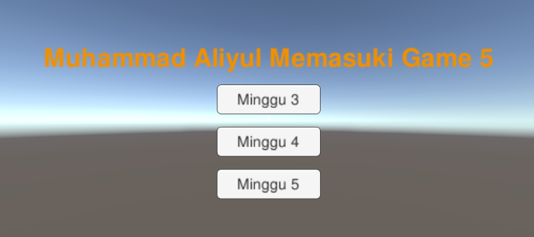
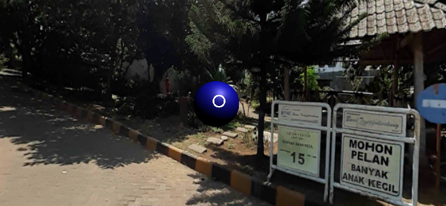
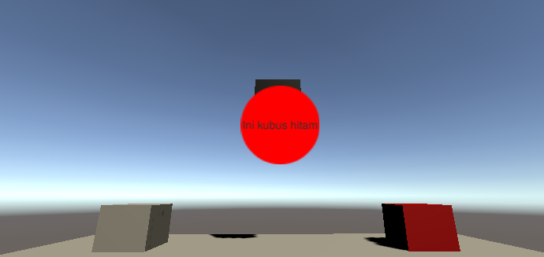
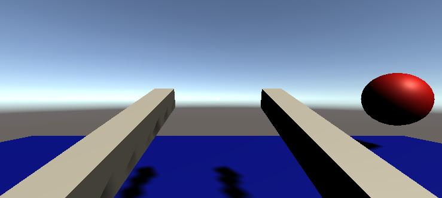

# Laporan Praktikum Minggu 6

Oleh: Muhammad Aliyul Murtadlo (1741720031)

1. Berikut ini adalah halaman utama

2. Berikut ini adalah kondisi ketika tombol level disorot menggunakan pointer

3. Berikut ini adalah kondisi ketika masing-masing tombol level diklik

4. Berikut ini adalah lingkungan game ketiga

5. Berikut ini adalah lingkungan game keempat

6. Berikut ini adalah lingkungan game kelima

